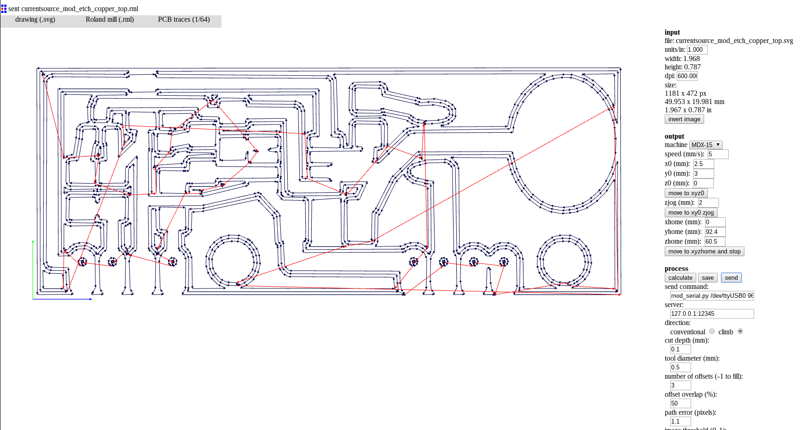

# Fab Modules Project

Fab Modules is a browser-based CAM system, which allows to generate toolpaths for and control
lasercutters, CNC-mills and waterjets commonly found in [fablabs](https://www.fablabs.io/).

## Supported machines

Lasercutters

* Epilog
* Trotec
* GCC
* Universal

Vinylcutters

* GCC
* Roland

CNC-mills

* Shopbot
* Roland MDX-15/20/40 and SRM-20
* Smoothieboard

Speciality machines

* Oxford ulaser
* Resonetics Excimer microlaser
* Omax waterjet

Other tools

* Generic G-code output
* Gerber file
* DXF and SVG output
* Mesh

## Installing

Download Fabmodules using git

    git clone https://github.com/FabModules/fabmodules-html5.git

Install the node.js dependencies

    npm install

## Using

Start the server which lets webinterface communicate with hardware

    npm start

Note: this does not serve the HTML/JS for the webclient (yet)

See [the wiki](https://github.com/FabModules/fabmodules-html5/wiki) for further instructions.

## License

Open source, [custom MIT-like license](./LICENSE.md)
